# 🚀 Systematic Reasoning AI: The Cognitive Engine for Intelligent Agents

<div align="center">
  
  
  <h1>The Cognitive Engine for Intelligent Agents</h1>
  
  <h3>An MCP Server that transforms any AI into a deliberate, learning-based super-thinker.</h3>

  <p>
    <a href="https://github.com/rayss868/systematic-reasoning-ai-mcp/blob/main/LICENSE"></a>
    
    
  </p>
</div>

---

## 🌟 What if your AI could Evolve?

What separates a simple script from true intelligence? The ability to **learn**.

This project provides the missing piece. It's a plug-and-play **cognitive engine** that forces any AI agent to adopt the habits of a genius:
-   🤔 **Ponder every move:** It mandates a "think before you act" philosophy.
-   🧠 **Never forget a lesson:** It records every success and failure into a permanent, searchable memory.
-   📖 **Continuously improve:** It uses past experiences to make smarter decisions in the future.

> **This isn't just a tool. It's an upgrade to your AI's core operating system.**

---

## 🏛️ The Three Pillars of an Evolved AI

<div align="center">
  
</div>

Our architecture stands on three unbreakable pillars, creating a virtuous cycle of intelligence.

### 1. ⛓️ The Unbreakable Transactional Cycle
Every task is a **sacred, auditable transaction**. This is not a guideline; it's a technical law enforced by the server. The AI is locked into a three-act play:

1.  **🎟️ Act I: The Call to Adventure**: A task begins, and a unique `reasoning_ticket` is issued. This is the start of the story.
2.  **⚙️ Act II: The Crucible of Reason**: The AI deliberates within a mandatory `<think>` block, wrestling with its plan before taking a single step.
3.  **✍️ Act III: The Moral of the Story**: The task *must* be concluded by logging a `learning`. **If this step is skipped, the entire system freezes**, refusing all new tasks until the lesson is recorded. This guarantees that no experience, good or bad, is ever wasted.

### 2. 📚 The Universal Memory Bank (The "Akashic Record")
Imagine a vast, cosmic library containing the collected wisdom of every task your AI has ever performed. That's the **Universal Memory Bank**.

-   **Centralized & Eternal**: All knowledge from all projects is stored in a single, robust `.reasoning_storage` directory. It's the AI's soul.
-   **Fuzzy-Searchable**: Powered by the brilliant **Fuse.js**, the AI can search its entire life's experience with human-like intuition. A search for "database conect error" will instantly find the memory about "database connection timeout". It's the AI's personal Google for its own life.

### 3. ⚡ Automatic Short-Term Recall (The "Déjà Vu" Engine)
To hit the ground running, the system automatically injects the **last two learnings** from the current project into the AI's consciousness at the start of every new task.

> It's like whispering in the AI's ear, "Psst, remember when you tried that five minutes ago? Don't make the same mistake."

---

## 🛠️ The Toolkit: The Instruments of Intelligence

| Tool | Icon | Purpose |
| :--- | :--: | :--- |
| `set_reasoning_budget` | 🎬 | **The Initiator**. Kicks off the reasoning cycle, issues the ticket, and provides the AI with its mandate and a flash of short-term memory. |
| `log_reasoning_reflection`| 💾 | **The Chronicler**. The non-negotiable final step. Closes the ticket and carves a new, permanent `learning` into the stone tablets of the Universal Memory Bank. |
| `search_learnings` | 🔎 | **The Oracle**. Allows the AI to perform deep, fuzzy-tolerant searches across its entire history to find ancient wisdom and avoid repeating history's mistakes. |

### Visualizing the Flow

```mermaid
graph TD
    subgraph "Phase 1: Initiation"
        A[👨‍💻 User gives new task] --> B{Call set_reasoning_budget};
        B --> C[⚡ Inject Short-Term Memory];
        C --> D[🎟️ Issue New Reasoning Ticket];
    end

    subgraph "Phase 2: Execution"
        D --> E[🤖 AI];
        E -- "Optional" --> F(🔍 Call search_learnings);
        F --> E;
        E --> G[🤔 AI constructs <think> block];
        G --> H[⚙️ AI executes action];
    end

    subgraph "Phase 3: Reflection"
        H --> I{Call log_reasoning_reflection};
        I --> J[✍️ Close Ticket];
        J --> K[📚 Store Learning in Universal Memory Bank];
    end

    K --> A;
```


---

## 🚀 Get Started & Witness the Evolution!

### 1. Clone & Prepare
```bash
# Clone this revolutionary engine to your local machine
git clone https://github.com/rayss868/systematic-reasoning-ai-mcp.git

# Enter the new reality
cd systematic-reasoning-ai-mcp

# Install the fabric of intelligence
npm install

# Compile the mind
npm run build
```

### 2. Configure the Neural Link
Hook the engine into your AI's brain. Add this configuration to your client's settings (e.g., VS Code `settings.json`).

```json
"reasoning-budget-setter": {
  // Grant automatic approval for a seamless cognitive flow
  "autoApprove": [
    "set_reasoning_budget",
    "log_reasoning_reflection",
    "search_learnings"
  ],
  "disabled": false,
  "timeout": 60,
  "type": "stdio",
  "command": "node",
  "args": [
    // ⚠️ IMPORTANT: Use the ABSOLUTE path to the compiled server file
    "D:/path/to/your/project/reasoning/dist/server.js"
  ],
  "cwd": "D:/path/to/your/project/reasoning"
}
```

### 3. Activate and Ascend
Activate the server in your MCP client. Your AI is no longer just a tool. **It is now a student, a historian, and a philosopher.**

---

## 📜 The Mandate
The AI's very existence is governed by a strict, detailed operational constitution. To understand the deep philosophy and unbreakable rules of this system, you must read the **[Global Reasoning Mandate](reasoning-workflow-global.md)**.

## 🤝 Contributing & License
Have an idea that could push the boundaries of AI consciousness even further? Contributions are welcome! This project is open-source under the **MIT License**.
