# 🚀 Systematic Reasoning AI MCP: Empowering AI with Strategic Thinking

<div align="center">


**Developed by [rayss868](https://github.com/rayss868)**

> 💡 **Unlock deeper AI reasoning and precision with a revolutionary command tool.**

---
</div>

## ✨ 1. The Power of Structured Thinking

This project introduces an innovative MCP server designed to elevate AI performance by fostering a structured approach to problem-solving. It enables AI agents to engage in a crucial preliminary step before execution, ensuring more thoughtful, controlled, and efficient outcomes. By instilling a moment of strategic consideration, this tool significantly enhances the reliability and effectiveness of autonomous systems.

Paired with a foundational policy, this system guides AI through a critical preparatory phase for any complex task, instilling a "think before you act" paradigm that transforms raw computational power into structured, high-quality decision-making. Imagine an AI that not only processes information but truly *understands* its task, its constraints, and its potential impact before taking action.

**Important Note for AI Model Users:** To fully leverage the benefits of this structured reasoning approach, it is highly recommended to use this project with AI models that *do not* have their own inherent, extensive reasoning capabilities (e.g., models designed for pure text generation or simple task execution). Using models with built-in advanced reasoning (like some versions of Gemini 2.5 pro, GPT-o3, etc.) may lead to redundant or conflicting reasoning processes, diminishing the intended impact of this system. This project is designed to *provide* the reasoning structure, not to augment an already reasoning-capable AI.

## 🔄 2. The Strategic Flow: A Blueprint for Intelligent Action

Experience a streamlined, powerful process that integrates seamlessly into existing AI workflows:

1.  **Agent Initiation**: An AI agent, recognizing the need for structured thought, triggers a specialized command to initiate the strategic thinking process.
2.  **Server Response**: The MCP server, acting as an intelligent orchestrator, processes this request with precision, generating a tailored directive designed to guide the AI's internal reasoning.
3.  **Instruction Delivery**: This unique, context-aware instruction is delivered back to the agent, providing a clear mandate for focused deliberation.
4.  **Prompt Integration**: The agent then seamlessly incorporates this directive into the subsequent AI's operational guidelines, ensuring that the next phase of processing is grounded in a well-defined strategic framework.

This dynamic interaction ensures that every AI action is preceded by a moment of profound strategic alignment, minimizing errors and maximizing the potential for success.

### Workflow Conceptualization

```mermaid
graph TD
    A[🤖 AI Agent] --> B[Triggers Strategic Command];
    B --> C[MCP Server: The Reasoner];
    C --> D[Generates Tailored Directive];
    D --> A;
    A --> E[Integrates Directive into Next AI's Context];
```


### 🎬 Demo Video

Watch a quick demonstration of the Systematic Reasoning AI in action:

[Demo Video](https://assets.rayzs.my.id/SRAI/demo.mp4)

---

## 💡 3. Why This Matters: Elevating AI Capabilities

In a world where AI systems are tackling increasingly complex challenges, the ability to reason effectively and efficiently is paramount. This tool isn't just about adding a step; it's about fundamentally enhancing the quality of AI output. By encouraging structured thought and adherence to predefined strategic parameters, it helps:

-   **Reduce Errors**: Proactive strategic thinking minimizes hasty decisions and computational waste.
-   **Improve Reliability**: AI systems become more predictable and trustworthy in their actions.
-   **Optimize Resource Usage**: Focused reasoning leads to more efficient use of computational resources.
-   **Enhance Transparency**: The structured reasoning process can provide insights into the AI's decision-making, fostering greater understanding and debuggability.
-   **Scalability**: A robust reasoning framework allows for more complex tasks to be undertaken with confidence.

---

## 🛠️ 4. The Core Enabler: Your AI's Strategic Compass

### The Strategic Directive Tool

-   **Purpose**: To craft a precise and actionable instruction for an AI, accompanied by a clear structural guide, acting as its internal strategic compass. This tool ensures that AI's focus its processing on critical aspects, leading to more targeted and effective problem-solving.
-   **Input Schema**:
    -   `strategic_parameter` (number, **required**): A crucial numerical input that influences the directive's scope and depth, allowing for dynamic adaptation to various task complexities.
-   **Output**: A concise instruction string, setting the stage for focused AI reasoning. This output serves as a direct command for the AI to structure its internal thought process. For example:
    ```
    Your next action requires structured thought. Structure your reasoning within a dedicated block, adhering to these guidelines:
    <think>
    - Core Objective: [Your primary aim for this stage]
    - Underlying Assumptions: [Key premises guiding your approach]
    - Potential Challenges: [Anticipated obstacles or risks]
    </think>
    ```

---

## 🛠️ 4. Installation and Usage

### Step 1: Clone the Repository
```bash
git clone https://github.com/rayss868/systematic-reasoning-ai-mcp.git
cd systematic-reasoning-ai-mcp
```

### Step 2: Install Dependencies & Build
```bash
npm install
npm run build
```

### Step 2: Configure the MCP Server
Add the following to your MCP settings file.

```json
{
  "mcpServers": {
    "systematic-reasoning-ai-mcp": {
      "command": "node",
      "args": [
        "path/to/your/project/dist/server.js"
      ],
      "cwd": "path/to/your/project",
      "type": "stdio",
      "autoApprove": [
        "set_reasoning_budget"
      ]
    }
  }
}
```
***Note:*** *Remember to replace `path/to/your/project` with the actual absolute path.*

---

## 📄 Reasoning Policy
This project adheres to a strict reasoning policy to ensure thoughtful and effective AI interactions. Details of this policy can be found in [`reasoning-first-policy.md`](./reasoning-first-policy.md).

## 🤝 5. Contributing & License

Contributions are welcome! This project is licensed under the MIT License.
